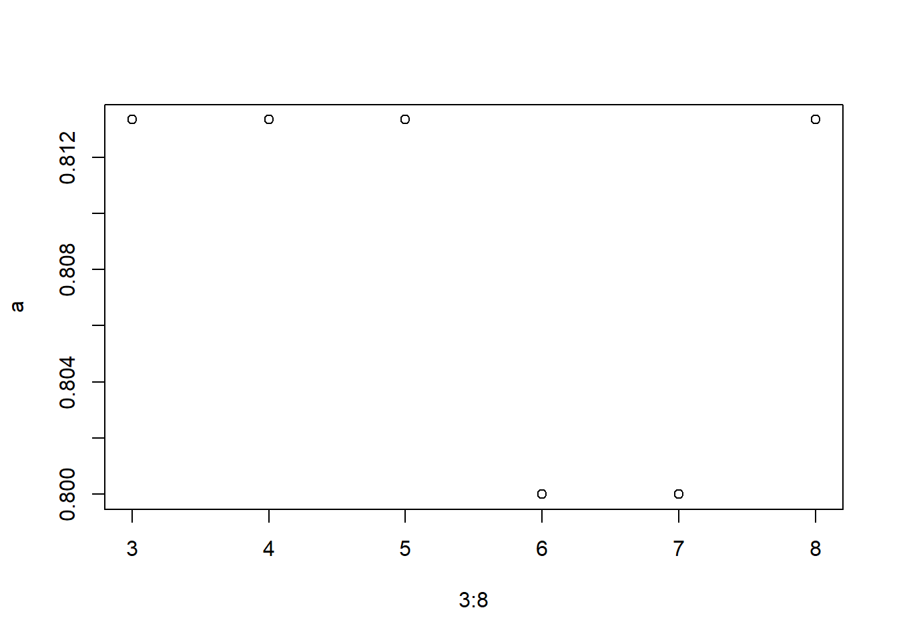
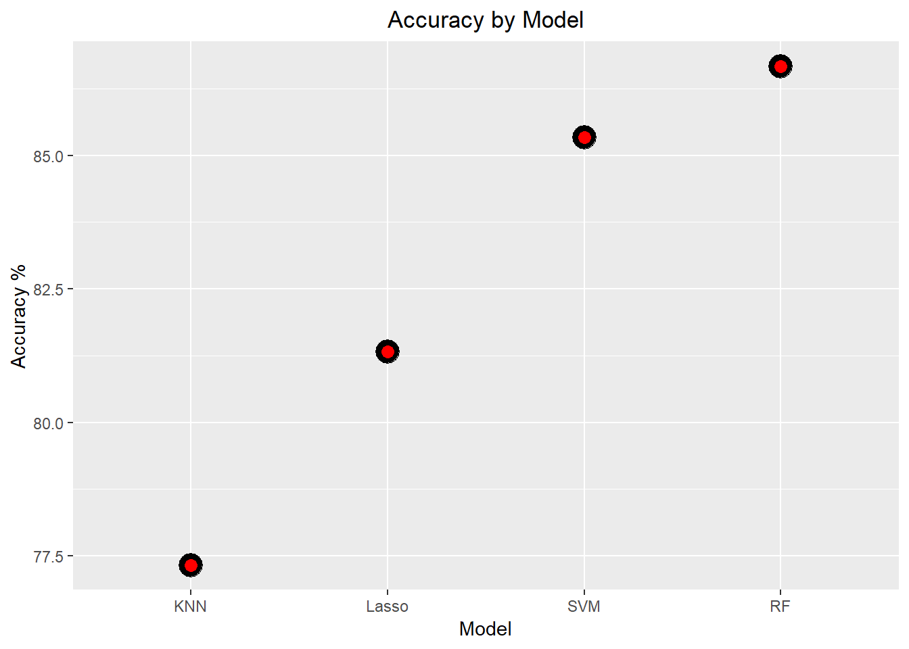

Alzheimer's Analysis
================

Adapted from: <https://www.kaggle.com/ruslankl/dementia-prediction-w-tree-based-models>

Introduction
============

About dementia
--------------

Dementia is not a specific disease. It's an overall term that describes a group of symptoms associated with a decline in memory or other thinking skills severe enough to reduce a person's ability to perform everyday activities. Alzheimer's disease accounts for 60 to 80 percent of cases. Vascular dementia, which occurs after a stroke, is the second most common dementia type. But there are many other conditions that can cause symptoms of dementia, including some that are reversible, such as thyroid problems and vitamin deficiencies.

Dementia is often incorrectly referred to as "senility" or "senile dementia," which reflects the formerly widespread but incorrect belief that serious mental decline is a normal part of aging. <https://www.alz.org/alzheimers-dementia/what-is-dementia>

Alzheimer's
-----------

Alzheimer's is a type of dementia that causes problems with memory, thinking and behavior. Symptoms usually develop slowly and get worse over time, becoming severe enough to interfere with daily tasks.

Overview of analysis
====================

The goal of this analysis serves two purposes. The first one is to predict whether a patient has Alzheimer's disease. The second is to identify individuals at risk of Alzheimer's disease.

Analysis
========

Import and Data (More Explanation to be Added)
----------------------------------------------

Here is a description of the variables:

| Variable Name: | Variable Description:               |
|----------------|-------------------------------------|
| `ID`           | Identification                      |
| `M/F`          | Gender (M if Male, F if Female)     |
| `Hand`         | Handedness                          |
| `Age`          | Age in years                        |
| `EDUC`         | Years of education                  |
| `SES`          | Socioeconomic Status                |
| `MMSE`         | Mini Mental State Examination       |
| `CDR`          | Clinical Dementia Rating            |
| `eTIV`         | Estimated Total Intracranial Volume |
| `nWBV`         | Normalize Whole Brain Volume        |
| `ASF`          | Atlas Scaling Factor                |
| `Delay`        | Delay                               |

``` r

MRI_data<-read.csv("oasis_longitudinal.csv", header = TRUE, stringsAsFactors = FALSE)
```

Understanding The Data
----------------------

``` r

dim(MRI_data)
## [1] 373  15
str(MRI_data)
## 'data.frame':    373 obs. of  15 variables:
##  $ Subject.ID: chr  "OAS2_0001" "OAS2_0001" "OAS2_0002" "OAS2_0002" ...
##  $ MRI.ID    : chr  "OAS2_0001_MR1" "OAS2_0001_MR2" "OAS2_0002_MR1" "OAS2_0002_MR2" ...
##  $ Group     : chr  "Nondemented" "Nondemented" "Demented" "Demented" ...
##  $ Visit     : int  1 2 1 2 3 1 2 1 2 3 ...
##  $ MR.Delay  : int  0 457 0 560 1895 0 538 0 1010 1603 ...
##  $ M.F       : chr  "M" "M" "M" "M" ...
##  $ Hand      : chr  "R" "R" "R" "R" ...
##  $ Age       : int  87 88 75 76 80 88 90 80 83 85 ...
##  $ EDUC      : int  14 14 12 12 12 18 18 12 12 12 ...
##  $ SES       : int  2 2 NA NA NA 3 3 4 4 4 ...
##  $ MMSE      : int  27 30 23 28 22 28 27 28 29 30 ...
##  $ CDR       : num  0 0 0.5 0.5 0.5 0 0 0 0.5 0 ...
##  $ eTIV      : int  1987 2004 1678 1738 1698 1215 1200 1689 1701 1699 ...
##  $ nWBV      : num  0.696 0.681 0.736 0.713 0.701 0.71 0.718 0.712 0.711 0.705 ...
##  $ ASF       : num  0.883 0.876 1.046 1.01 1.034 ...
summary(MRI_data)
##   Subject.ID           MRI.ID             Group               Visit      
##  Length:373         Length:373         Length:373         Min.   :1.000  
##  Class :character   Class :character   Class :character   1st Qu.:1.000  
##  Mode  :character   Mode  :character   Mode  :character   Median :2.000  
##                                                           Mean   :1.882  
##                                                           3rd Qu.:2.000  
##                                                           Max.   :5.000  
##                                                                          
##     MR.Delay          M.F                Hand                Age       
##  Min.   :   0.0   Length:373         Length:373         Min.   :60.00  
##  1st Qu.:   0.0   Class :character   Class :character   1st Qu.:71.00  
##  Median : 552.0   Mode  :character   Mode  :character   Median :77.00  
##  Mean   : 595.1                                         Mean   :77.01  
##  3rd Qu.: 873.0                                         3rd Qu.:82.00  
##  Max.   :2639.0                                         Max.   :98.00  
##                                                                        
##       EDUC           SES            MMSE            CDR        
##  Min.   : 6.0   Min.   :1.00   Min.   : 4.00   Min.   :0.0000  
##  1st Qu.:12.0   1st Qu.:2.00   1st Qu.:27.00   1st Qu.:0.0000  
##  Median :15.0   Median :2.00   Median :29.00   Median :0.0000  
##  Mean   :14.6   Mean   :2.46   Mean   :27.34   Mean   :0.2909  
##  3rd Qu.:16.0   3rd Qu.:3.00   3rd Qu.:30.00   3rd Qu.:0.5000  
##  Max.   :23.0   Max.   :5.00   Max.   :30.00   Max.   :2.0000  
##                 NA's   :19     NA's   :2                       
##       eTIV           nWBV             ASF       
##  Min.   :1106   Min.   :0.6440   Min.   :0.876  
##  1st Qu.:1357   1st Qu.:0.7000   1st Qu.:1.099  
##  Median :1470   Median :0.7290   Median :1.194  
##  Mean   :1488   Mean   :0.7296   Mean   :1.195  
##  3rd Qu.:1597   3rd Qu.:0.7560   3rd Qu.:1.293  
##  Max.   :2004   Max.   :0.8370   Max.   :1.587  
## 

#Drop hand
table(MRI_data$Hand)
## 
##   R 
## 373
MRI_data$Hand<-NULL

#Drop Ids
subject_id<-MRI_data$Subject.ID
MRI_id<-MRI_data$MRI.ID

MRI_data$Subject.ID<-NULL
MRI_data$MRI.ID<-NULL


#Checking for null values
sort(apply(MRI_data, 2, function(x){sum(is.na(x))}), decreasing = TRUE)
##      SES     MMSE    Group    Visit MR.Delay      M.F      Age     EDUC 
##       19        2        0        0        0        0        0        0 
##      CDR     eTIV     nWBV      ASF 
##        0        0        0        0

table(MRI_data$SES)
## 
##   1   2   3   4   5 
##  88 103  82  74   7
```

After generating various descriptions of the data. I find there to be 371 observations and 15 columns.Two of those columns are ID which I will drop and another two of them measure the whether a patient has Alzheimer's disease and to what degree. As state earlier, my goal is to predict whether a patient has Alzheimer's so I decided that when I create my models, I will collapse CDR into a binary variable which identifies Alzheimer's or not. In addition, I noticed that handedness is the same value for all observations which makes it useless.

Of the 371 observations, 21 of them have missing data. Given the size of the data set, dropping these observations would lose too much information. Thus I will need to make imputation decisions when the time comes to model.

Exploratory Data Analysis and Visualization
===========================================

``` r
#Relationship between Male/Female and CDR
ggplot(MRI_data, aes(as.factor(CDR), Age))+
  geom_boxplot(col = "blue")+
  ggtitle("Degree of CDR by Age")+
  xlab("CDR")+
  theme(plot.title = element_text(hjust = .5))
```


``` r


ggplot(MRI_data, aes(as.factor(CDR), Age, fill = M.F))+
  geom_boxplot()+
  ggtitle("Degree of CDR by Age")+
  xlab("CDR")+
  #geom_text(stat = "count", aes(label = ..count..), y = 60, col = "red")+
  theme(plot.title = element_text(hjust = .5))
```


``` r

MRI_data%>%
  group_by(as.factor(CDR), as.factor(M.F))%>%
  summarise(n = n())
## # A tibble: 8 x 3
## # Groups:   as.factor(CDR) [?]
##   `as.factor(CDR)` `as.factor(M.F)`     n
##   <fct>            <fct>            <int>
## 1 0                F                  142
## 2 0                M                   64
## 3 0.5              F                   50
## 4 0.5              M                   73
## 5 1                F                   19
## 6 1                M                   22
## 7 2                F                    2
## 8 2                M                    1


table(MRI_data$CD)
## 
##   0 0.5   1   2 
## 206 123  41   3
MRI_data$CDR<-ifelse(MRI_data$CDR==2, 1, MRI_data$CDR)
```

The first thing I want to do is get a better idea of what influences the target variable CDR. I examined which variables intuitive impact CDR. Age is one of the most obvious choices to me.

It seems like the medians are the same for *C**D**R* = 0 and *C**D**R* = .5. While, *C**D**R* = 1 has the lowest median age. I would have thought that the median Age would have been higher for increasing levels of CDR. Perhaps the increased variability in *C**D**R* = 0 is part of the reason.

An oddity is the distribution of *C**D**R* = 2. It is oddly skewed and inconsistent with the pattern. To better understand what is going on, I grouped by Male/Female. We see that there is no variability for Males where *C**D**R* = 2. Creating a table shows that only 3 observations belong to *C**D**R* = 2. Since I will eventually predict CDR, I'm going to group *C**D**R* = 1 and *C**D**R* = 2.

``` r
#Distribution looks better after binning
ggplot(MRI_data, aes(as.factor(CDR), Age))+
  geom_boxplot()+
  ggtitle("Degree of CDR by Age")+
  xlab("CDR")+
  theme(plot.title = element_text(hjust = .5))
```


``` r


ggplot(MRI_data, aes(as.factor(CDR), Age, fill = M.F))+
  geom_boxplot()+
  ggtitle("Degree of CDR by Age")+
  xlab("CDR")+
  #geom_text(stat = "count", aes(label = ..count..), y = 60, col = "red")+
  theme(plot.title = element_text(hjust = .5))
```


``` r

ggplot(MRI_data, aes(Age, fill = M.F))+
  geom_histogram()+
  facet_wrap(~M.F)+
  scale_fill_manual(values = c("red", "blue"))+
  ggtitle("Distribution of Age by Sex")+
  theme(plot.title = element_text(hjust = .5))
## `stat_bin()` using `bins = 30`. Pick better value with `binwidth`.
```


``` r


ggplot(MRI_data, aes(M.F, fill = M.F))+
  geom_bar()+
  scale_fill_manual(values = c("red", "blue"))+
  geom_text(stat = "count", aes(label = ..count..), y = 5, col = "white", fontface = "bold")+
  ggtitle("Count of Male vs Female")+
  theme(plot.title = element_text(hjust = .5))
```


After binning the CDR values, I think the distributions look a lot better in both cases. When grouping by Male/Female and not.

A logical next step is analyzing Male/Female. I just used this variable in my analysis on CDR and Age, so I should make sure the distributions Male/Female for age are solid. The histograms show that the distributions are almost identical. There is a slight bump in frequency around *A**g**e* = 73 for females which is worth noting. The counts of Male/Female are balanced enough that I shouldn't experience any issue when creating models.

``` r

ggplot(MRI_data, aes(Group, fill = as.factor(CDR)))+
  geom_bar()+
  ggtitle("Count of Group by CDR")+
  theme(plot.title = element_text(hjust = .5))
```


``` r

  
MRI_data%>%
  group_by(Group, as.factor(CDR))%>%
  summarise(n = n())
## # A tibble: 6 x 3
## # Groups:   Group [?]
##   Group       `as.factor(CDR)`     n
##   <chr>       <fct>            <int>
## 1 Converted   0                   18
## 2 Converted   0.5                 19
## 3 Demented    0.5                102
## 4 Demented    1                   44
## 5 Nondemented 0                  188
## 6 Nondemented 0.5                  2

#get row number
MRI_data[which(MRI_data$Group == "Nondemented" & MRI_data$CDR == .5),]
##          Group Visit MR.Delay M.F Age EDUC SES MMSE CDR eTIV  nWBV   ASF
## 9  Nondemented     2     1010   M  83   12   4   29 0.5 1701 0.711 1.032
## 31 Nondemented     3      617   M  81   12   3   27 0.5 1814 0.759 0.968

MRI_data<-MRI_data[-c(9, 31),]
```

The description of CDR and Group seem to be measuring the same thing. CDR measures the degree of dementia while Group classifies if a person has dementia or not (I am not sure what converted means, I will have to do some research). I want to further investigate if these variables are similar. For the most part, the stacked bar chart supports my claim that CDR and Group are the same variable. In the Nondemented group, there are 2 observations which have *C**D**R* = .5, meaning mild dementia. This does not seem right to me. I wonder if there was a data entry error or something of the sort. I will drop these 2 observations because I am not comfortable data that may be wrong.

``` r
ggplot(MRI_data, aes(Group, EDUC))+
  geom_boxplot(col = "blue")+
  geom_point(stat = "summary", fun.y = "mean", col = "red", size = 4)+
  ggtitle("Education and Dementia")+
  theme(plot.title = element_text(hjust = .5))
```


``` r

#No real difference
#ggplot(MRI_data, aes(M.F, EDUC))+
#  geom_boxplot(col = "blue")+
#  ggtitle("Years of Education by Sex")+
#  theme(plot.title = element_text(hjust = .5))

anova(aov(EDUC~M.F, data = MRI_data))
## Analysis of Variance Table
## 
## Response: EDUC
##            Df  Sum Sq Mean Sq F value  Pr(>F)  
## M.F         1   27.92 27.9206  3.3933 0.06626 .
## Residuals 369 3036.19  8.2281                  
## ---
## Signif. codes:  0 '***' 0.001 '**' 0.01 '*' 0.05 '.' 0.1 ' ' 1
kruskal.test(MRI_data$EDUC, as.factor(MRI_data$M.F))
## 
##  Kruskal-Wallis rank sum test
## 
## data:  MRI_data$EDUC and as.factor(MRI_data$M.F)
## Kruskal-Wallis chi-squared = 3.8159, df = 1, p-value = 0.05077
```

I am curious about the relationship between Group and Education. I wonder if perhaps the more education one has, the less likely dementia occurs. There appears to be a difference in median years of education between Demented and Nondemented. As I suspect, the nondemented group has a higher average years of education (red dot) and higher median years of education than Demented. To further solidify this, I will conduct a Kruskal-Wallis test of medians and an ANOVA of means. Kruskal-Wallis simplifies down to the Wilcoxon Rank Sum test for *g**r**o**u**p* = 2 and ANOVA simplifies down to a two sample t-test when *g**r**o**u**p* = 2. The p values for both tests are somewhat low which indicates that there is a difference in medians and means.

``` r
#There appears to be a slight positive correlation between Education and MMSE score
ggplot(MRI_data, aes(Group, MMSE))+
  geom_point(col = "blue")+
  geom_point(stat = "summary", fun.y = "mean", col = "red", size = 5)+
  geom_point(stat = "summary", fun.y = "median", col = "green", size = 5)+
  ggtitle("MMSE by Group")+
  theme(plot.title = element_text(hjust = .5))
## Warning: Removed 2 rows containing non-finite values (stat_summary).

## Warning: Removed 2 rows containing non-finite values (stat_summary).
## Warning: Removed 2 rows containing missing values (geom_point).
```


``` r

ggplot(MRI_data, aes(EDUC, MMSE, col = M.F))+
  geom_point()+
  geom_smooth(method = "lm", se = FALSE)+
  ggtitle("EDUC vs MMSE by Sex")+
  theme(plot.title = element_text(hjust = .5))
## Warning: Removed 2 rows containing non-finite values (stat_smooth).

## Warning: Removed 2 rows containing missing values (geom_point).
```


During my initial researching of what each variables mean, I found that MMSE score is higher for people without dementia. As always, it is good to verify statements like this. The dot plot with mean (red) and median (green) for each group show that the nondemented group has a higher average and higher median MMSE score.

Knowing the relationship between MMSE and dementia, I want to see if I can identify individuals who score better on MMSE. My guess is that years of education has some impact. The scatter plot with linear regression lines for Male and Female show a positive correlation between EDUC and MMSE. As suspected, it tends to be that the more years of education one has, the higher the MMSE score. Note that a relationship does not imply causation.

``` r
ggplot(MRI_data, aes(as.factor(CDR), ASF, fill = as.factor(CDR)))+
  geom_boxplot(aes(x = CDR+.1, group = as.factor(CDR)), width = .25)+
  ggtitle("ASF by CDR")+
  geom_dotplot(aes(x = CDR-.1, group = as.factor(CDR)), binaxis = "y", binwidth = .01, stackdir = "center")+
  theme(plot.title = element_text(hjust = .5))
```


In the data description, there are a few more technical numeric variables. I am interested in if these have an impact on dementia. It appears that the distributions of ASF across different degrees of dementia are very similar. There does appear to be a decrease in variability as the severity of dementia increases.

Modeling
========

Imputation
----------

``` r
sort(apply(MRI_data, 2, function(x){sum(is.na(x))}), decreasing = TRUE)
##      SES     MMSE    Group    Visit MR.Delay      M.F      Age     EDUC 
##       19        2        0        0        0        0        0        0 
##      CDR     eTIV     nWBV      ASF 
##        0        0        0        0
MRI_data$MMSE<-ifelse(is.na(MRI_data$MMSE), median(MRI_data$MMSE, na.rm = TRUE), MRI_data$MMSE)
#knn_impute<-preProcess(MRI_data, method = c("knnImpute"))
#blah<-predict(knn_impute, MRI_data)

MRI_data$SES<-ifelse(is.na(MRI_data$SES), median(MRI_data$SES, na.rm = TRUE), MRI_data$SES)
```

As covered earlier, there are some missing values that need to be taken care of. Imputing the median for MMSE is straightforward. There are only two two missing values so there is not much to think about here.

Imputing values for SES is a bit tricky. SES is an ordinal variable which gets coded as an integer. However, SES is really categorical in nature. I am not familiar with techniques for imputing an ordinal variable. I decided to impute the median. In a future version, I may research and try a few other imputation methods for ordinal variables. Possibly KNN.

Factor Variables
----------------

### Dummy Variables

``` r
MRI_data$Group<-as.factor(MRI_data$Group)
MRI_data$M.F<-as.factor(MRI_data$M.F)
MRI_data$CDR<-as.factor(ifelse(MRI_data$CDR==.5, 1, MRI_data$CDR))


factor_variables<-MRI_data[, sapply(MRI_data, is.factor)]
CDR<-factor_variables$CDR
dum_var<-dummyVars(~., factor_variables[,-3])
factor_variables<-as.data.frame(predict(dum_var, factor_variables[,-3]))
factor_variables<-as.data.frame(cbind(factor_variables, CDR))
```

I convert appropriate variables to factor and collapse CDR into demented and non demented. To use these the factor variables in my models, I have to turn them into dummy variables. The caret package has a dummyVars function which makes creating dummy variables simple.

Numeric Variables
-----------------

### Multicolinearity

``` r
numeric_variables<-MRI_data[, sapply(MRI_data, is.numeric)]
correlations<-cor(numeric_variables)
highCorr<-findCorrelation(correlations, cutoff = .75)
numeric_variables<-numeric_variables[,-highCorr]
```

After dealing with factor variables, I turn my attention to numeric variables. It is important to check if any predictors are correlated with each other. If the are, predictive performance may suffer and numerical instability is introduced. The caret package has a function findCorrelation which does a great job of dealing with this issue. I usually pick .75 as a starting point and adjust based on the data. Filtering for correlated predictors drops two variables from the model.

### Center and Scale

``` r
numeric_variables$Visit<-scale(numeric_variables$Visit)
numeric_variables$Age<-scale(numeric_variables$Age)
numeric_variables$EDUC<-scale(numeric_variables$EDUC)
numeric_variables$MMSE<-scale(numeric_variables$MMSE)
numeric_variables$nWBV<-scale(numeric_variables$nWBV)
numeric_variables$ASF<-scale(numeric_variables$ASF)
```

Next I center and scale all numeric predictors. Some models benefit from having variables on the same scale. I could use the preProcess function in caret, however since there are so few variables, I will just do the center and scaling manually.

``` r
#drop group

train<-as.data.frame(cbind(numeric_variables, factor_variables))

train<-train[,c(-8,-9,-10)]
```

Dropping group variables.

Logistic Regression with *L*<sub>1</sub>*P**e**n**a**l**t**y*
-------------------------------------------------------------

``` r
#lasso

# splitting data into training set and validation set with 80-20 split
sample_size<-floor(0.8*nrow(train))
train_ind<-sample(seq_len(nrow(train)), size=sample_size)

train_set<-train[train_ind,]
valid_set<-train[-train_ind,]

ctrl<-trainControl(method = "cv", number = 10)
set.seed(11)
lasso.mod<-train(CDR~., data = train_set, method = "glmnet", metric = "Accuracy", trControl = ctrl,
                 tuneGrid = expand.grid(alpha = 1, lambda = seq(0, .015, length = 30)))

max(lasso.mod$results$Accuracy)
## [1] 0.8240934
lasso.mod$bestTune
##    alpha     lambda
## 27     1 0.01344828
coef(lasso.mod$finalModel, lasso.mod$finalModel$lambdaOpt)
## 10 x 1 sparse Matrix of class "dgCMatrix"
##                         1
## (Intercept)  8.558738e-01
## Visit        .           
## Age         -4.245193e-01
## EDUC        -4.027809e-01
## SES         -1.144802e-01
## MMSE        -2.508365e+00
## nWBV        -5.300307e-01
## ASF          1.608397e-01
## M.F.F       -7.981964e-01
## M.F.M        3.812047e-13
```

I start by setting the seed to make my results reproducible. I use the glmnet method to fit a logistic regression model with the *L*<sub>1</sub> penalty. This penalty can shrink some coefficients to 0. This conducts feature selection and helps with overfitting. The best tune was when *λ* = .000517 which produces an accuracy of ~83%.

Based on the coefficients, there weren't any variables dropped from the model. It seems that Age, EDUC, SES, and ASF have the largest coefficients. It will be interesting to check the variable importance of other models I run.

Prediction Accuracy of Logistic Regression
------------------------------------------

``` r
pred<-predict(lasso.mod, train_set)
confusionMatrix(pred, train_set$CDR)
## Confusion Matrix and Statistics
## 
##           Reference
## Prediction   0   1
##          0 157  37
##          1  14  88
##                                           
##                Accuracy : 0.8277          
##                  95% CI : (0.7798, 0.8689)
##     No Information Rate : 0.5777          
##     P-Value [Acc > NIR] : < 2.2e-16       
##                                           
##                   Kappa : 0.6379          
##  Mcnemar's Test P-Value : 0.002066        
##                                           
##             Sensitivity : 0.9181          
##             Specificity : 0.7040          
##          Pos Pred Value : 0.8093          
##          Neg Pred Value : 0.8627          
##              Prevalence : 0.5777          
##          Detection Rate : 0.5304          
##    Detection Prevalence : 0.6554          
##       Balanced Accuracy : 0.8111          
##                                           
##        'Positive' Class : 0               
## 

pred<-predict(lasso.mod, valid_set)
confusionMatrix(data=pred, reference=valid_set$CDR)
## Confusion Matrix and Statistics
## 
##           Reference
## Prediction  0  1
##          0 33 13
##          1  2 27
##                                           
##                Accuracy : 0.8             
##                  95% CI : (0.6917, 0.8835)
##     No Information Rate : 0.5333          
##     P-Value [Acc > NIR] : 1.417e-06       
##                                           
##                   Kappa : 0.606           
##  Mcnemar's Test P-Value : 0.009823        
##                                           
##             Sensitivity : 0.9429          
##             Specificity : 0.6750          
##          Pos Pred Value : 0.7174          
##          Neg Pred Value : 0.9310          
##              Prevalence : 0.4667          
##          Detection Rate : 0.4400          
##    Detection Prevalence : 0.6133          
##       Balanced Accuracy : 0.8089          
##                                           
##        'Positive' Class : 0               
## 
```

After fitting the logistic regression model using the training data, I use the model with the validation set to predict the CDR (Dementia rating, either 0 or 1). The results of the prediction is shown in the confusion matrix. Accuracy of ~80% was achieved with the logistic regression model.

Support Vector Machine
----------------------

``` r
#SVM
set.seed(11)
svm.mod<-train(CDR~., data = train_set, method = "svmRadial", metric = "Accuracy", trControl = ctrl, tuneLength = 15)
varImp(svm.mod)
## ROC curve variable importance
## 
##       Importance
## MMSE     100.000
## nWBV      51.526
## EDUC      37.925
## M.F.M     35.340
## M.F.F     35.340
## SES       13.956
## Age        6.159
## Visit      0.501
## ASF        0.000

#.86
max(svm.mod$results$Accuracy)
## [1] 0.8513496
svm.mod$bestTune
##       sigma C
## 6 0.1171142 8
```

Next I fit a support vector machine. These models tend to be powerful at the expense of interpretability. The best tune is *C**o**s**t* = 8 with accuracy of 86%. Notably better than the logistic regression model previously fitted. According to variable importance of the support vector machine, MMSE is by far the most important variable. Second most important is nWBV. Then, sex and EDUC are tied for third. Interesting to compare with the coefficients of the logistic regression.

Prediction Accuracy of SVM
--------------------------

``` r

pred<-predict(svm.mod, train_set)
confusionMatrix(pred, train_set$CDR)
## Confusion Matrix and Statistics
## 
##           Reference
## Prediction   0   1
##          0 169  17
##          1   2 108
##                                           
##                Accuracy : 0.9358          
##                  95% CI : (0.9016, 0.9609)
##     No Information Rate : 0.5777          
##     P-Value [Acc > NIR] : < 2.2e-16       
##                                           
##                   Kappa : 0.8663          
##  Mcnemar's Test P-Value : 0.001319        
##                                           
##             Sensitivity : 0.9883          
##             Specificity : 0.8640          
##          Pos Pred Value : 0.9086          
##          Neg Pred Value : 0.9818          
##              Prevalence : 0.5777          
##          Detection Rate : 0.5709          
##    Detection Prevalence : 0.6284          
##       Balanced Accuracy : 0.9262          
##                                           
##        'Positive' Class : 0               
## 

pred<-predict(svm.mod, valid_set)
confusionMatrix(data=pred, reference=valid_set$CDR)
## Confusion Matrix and Statistics
## 
##           Reference
## Prediction  0  1
##          0 34 12
##          1  1 28
##                                           
##                Accuracy : 0.8267          
##                  95% CI : (0.7219, 0.9043)
##     No Information Rate : 0.5333          
##     P-Value [Acc > NIR] : 9.7e-08         
##                                           
##                   Kappa : 0.6585          
##  Mcnemar's Test P-Value : 0.005546        
##                                           
##             Sensitivity : 0.9714          
##             Specificity : 0.7000          
##          Pos Pred Value : 0.7391          
##          Neg Pred Value : 0.9655          
##              Prevalence : 0.4667          
##          Detection Rate : 0.4533          
##    Detection Prevalence : 0.6133          
##       Balanced Accuracy : 0.8357          
##                                           
##        'Positive' Class : 0               
## 
```

Testing on the validation set, the SVM model predicts the correct CDR with ~83% accuracy.

KNN
---

``` r
set.seed(11)
knn.mod<-train(CDR~., data = train_set, method = "knn", metric = "Accuracy", trControl = ctrl,
               tuneGrid = data.frame(.k = 1:20))

#.81
knn.mod$bestTune
##   k
## 1 1
max(knn.mod$results$Accuracy)
## [1] 0.8204227
```

Now I create a KNN model. The optimal tune is with *k* = 5. This means that when predicting a new point, the five "closest" points determine what the new one will be. With an accuracy of 81%, there is a drop in performance compared to logistic regression and support vector machine.

Prediction Accuracy of KNN
--------------------------

``` r

pred<-predict(knn.mod, train_set)
confusionMatrix(pred, train_set$CDR)
## Confusion Matrix and Statistics
## 
##           Reference
## Prediction   0   1
##          0 171   0
##          1   0 125
##                                      
##                Accuracy : 1          
##                  95% CI : (0.9876, 1)
##     No Information Rate : 0.5777     
##     P-Value [Acc > NIR] : < 2.2e-16  
##                                      
##                   Kappa : 1          
##  Mcnemar's Test P-Value : NA         
##                                      
##             Sensitivity : 1.0000     
##             Specificity : 1.0000     
##          Pos Pred Value : 1.0000     
##          Neg Pred Value : 1.0000     
##              Prevalence : 0.5777     
##          Detection Rate : 0.5777     
##    Detection Prevalence : 0.5777     
##       Balanced Accuracy : 1.0000     
##                                      
##        'Positive' Class : 0          
## 

pred<-predict(knn.mod, valid_set)
confusionMatrix(data=pred, reference=valid_set$CDR)
## Confusion Matrix and Statistics
## 
##           Reference
## Prediction  0  1
##          0 30 15
##          1  5 25
##                                           
##                Accuracy : 0.7333          
##                  95% CI : (0.6186, 0.8289)
##     No Information Rate : 0.5333          
##     P-Value [Acc > NIR] : 0.0003061       
##                                           
##                   Kappa : 0.4737          
##  Mcnemar's Test P-Value : 0.0441713       
##                                           
##             Sensitivity : 0.8571          
##             Specificity : 0.6250          
##          Pos Pred Value : 0.6667          
##          Neg Pred Value : 0.8333          
##              Prevalence : 0.4667          
##          Detection Rate : 0.4000          
##    Detection Prevalence : 0.6000          
##       Balanced Accuracy : 0.7411          
##                                           
##        'Positive' Class : 0               
## 
```

Testing on the training set, we get an accuracy of 100%. Combined with the relatively low accuracy of 72% on the validation set, there is a case for overfitting with the KNN model. In the future, steps should be taken to reduce overfitting and increase performance on the validation set.

Random Forest
-------------

``` r
set.seed(11)
rf.mod<-randomForest(CDR~., data = train_set, importance =T)
importance(rf.mod, type = 1)
##       MeanDecreaseAccuracy
## Visit            -2.973238
## Age              12.018671
## EDUC             21.171153
## SES              10.900207
## MMSE             70.601100
## nWBV             15.847014
## ASF              15.115106
## M.F.F            11.485487
## M.F.M            12.839844
```

Further investigating variable importance, I turn to random forest. I use the variable importance aspect of the model to compare with logistic regression support vector machine. Due to the biased nature of randomForest default variable importance method, I use importance = T and type = 1. It seems like MMSE is most important, followed by nWBV and EDUC. Very similar to the support vector's variable importance! Interesting!

``` r
pred<-predict(rf.mod, train_set)
confusionMatrix(pred, train_set$CDR)
## Confusion Matrix and Statistics
## 
##           Reference
## Prediction   0   1
##          0 171   0
##          1   0 125
##                                      
##                Accuracy : 1          
##                  95% CI : (0.9876, 1)
##     No Information Rate : 0.5777     
##     P-Value [Acc > NIR] : < 2.2e-16  
##                                      
##                   Kappa : 1          
##  Mcnemar's Test P-Value : NA         
##                                      
##             Sensitivity : 1.0000     
##             Specificity : 1.0000     
##          Pos Pred Value : 1.0000     
##          Neg Pred Value : 1.0000     
##              Prevalence : 0.5777     
##          Detection Rate : 0.5777     
##    Detection Prevalence : 0.5777     
##       Balanced Accuracy : 1.0000     
##                                      
##        'Positive' Class : 0          
## 

pred<-predict(rf.mod, valid_set)
confusionMatrix(pred, valid_set$CDR)
## Confusion Matrix and Statistics
## 
##           Reference
## Prediction  0  1
##          0 32 10
##          1  3 30
##                                           
##                Accuracy : 0.8267          
##                  95% CI : (0.7219, 0.9043)
##     No Information Rate : 0.5333          
##     P-Value [Acc > NIR] : 9.7e-08         
##                                           
##                   Kappa : 0.6561          
##  Mcnemar's Test P-Value : 0.09609         
##                                           
##             Sensitivity : 0.9143          
##             Specificity : 0.7500          
##          Pos Pred Value : 0.7619          
##          Neg Pred Value : 0.9091          
##              Prevalence : 0.4667          
##          Detection Rate : 0.4267          
##    Detection Prevalence : 0.5600          
##       Balanced Accuracy : 0.8321          
##                                           
##        'Positive' Class : 0               
## 
```

The random forest with default parameters (nTree = 500, mtry = 2) achieves 100% accuracy on the training set and 86.7% on the validation set, performing better than most of the other models. The parameters should be fine-tuned to achieve better accuracy on the validation set. Below I attempt to find the optimal mtry (number of variables at each split):

``` r
a = c()
i=5
for (i in 3:8) {
  rf.mod<-randomForest(CDR~., data=train_set, ntree = 500, mtry = i, importance = T)
  pred<-predict(rf.mod, valid_set)
  a[i-2] = mean(pred == valid_set$CDR)
}
a
## [1] 0.8133333 0.8133333 0.8133333 0.8000000 0.8000000 0.8133333
plot(3:8, a)
```



``` r
# rf.mod<-randomForest(CDR~., data=train_set, ntree = 500, mtry = 6, importance = T)
# pred<-predict(rf.mod, train_set)
# confusionMatrix(pred, train_set$CDR)
# 
# pred<-predict(rf.mod, valid_set)
# confusionMatrix(pred, valid_set$CDR)
```

The plot shows that using 3,4 and 6 variables at each split all perform equally well compared to the default of 2. There a dip in accuracy going from 4 to 5, and after 6 variables.Next we will optimize the number of trees to grow.

------------------------------------------------------------------------

Model Assessment
================

``` r
models<-list("lasso" = lasso.mod, "svm" = svm.mod, "knn" = knn.mod)
modelCor(resamples(models))
##             lasso         svm       knn
## lasso  1.00000000 -0.05486965 0.6432977
## svm   -0.05486965  1.00000000 0.4627287
## knn    0.64329768  0.46272867 1.0000000


mod_accuracy<-c(0.8133, 0.8533,
                0.7733, 0.8667)
Model<-c("Lasso", "SVM", "KNN", "RF")

data.frame(Model, mod_accuracy)%>%
  ggplot(aes(reorder(Model, mod_accuracy), mod_accuracy*100))+
  geom_point(col = "black", size = 6)+
  geom_point(col = "red", size = 3)+
  ggtitle("Accuracy by Model")+
  ylab("Accuracy %")+
  xlab("Model")+
  theme(plot.title = element_text(hjust = .5))
```



After creating models, I like to check their correlation with each other. Looks like lasso is not very correlated with the support vector machine and KNN. Finally, the KNN is not strongly correlated with any of the other models. If I were to try stacking or some other type of ensemble, these models would be good candidates since they are fit very differently and have low correlation.

In terms of individual model performance based on accuracy, we see that the random forest performs the best with support vector close behind. There is a noticeable drop to lasso and another big drop to KNN.
